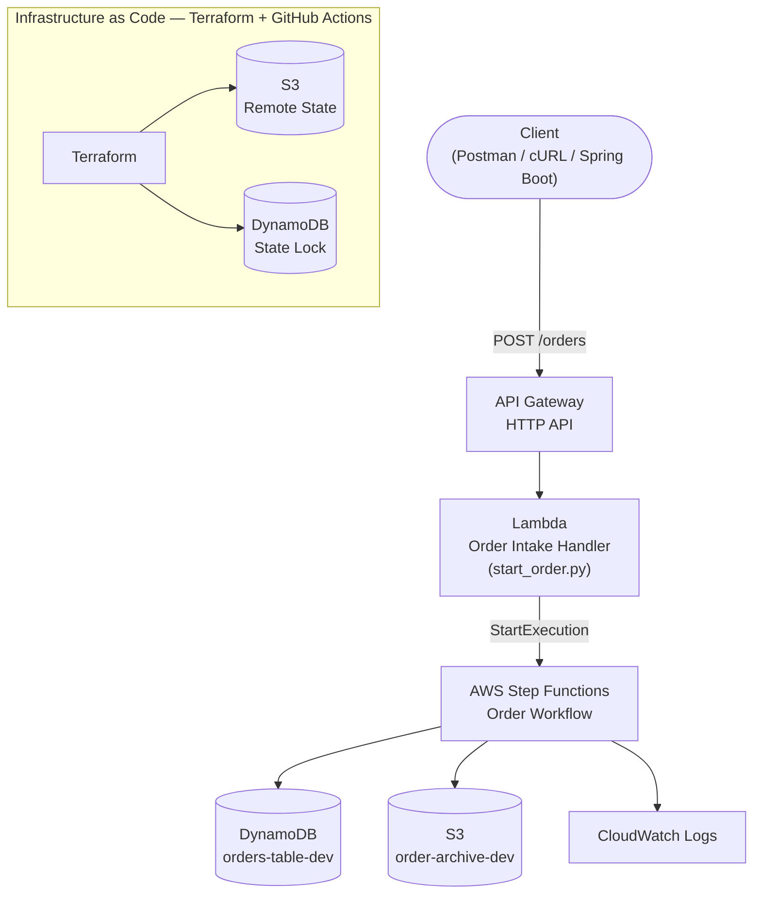
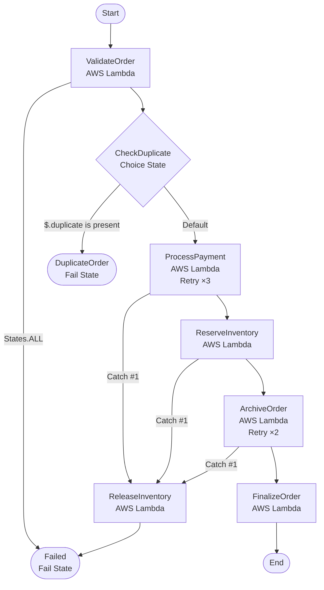

# Order Processing System -- AWS Serverless Project

## Overview

This project is a production-style serverless Order Processing System
built using Terraform and AWS services. It provisions infrastructure for
secure order intake, workflow orchestration, and persistence using
Infrastructure as Code (IaC).

------------------------------------------------------------------------

# Architecture Diagram

## System Overview



## Step Functions Workflow



------------------------------------------------------------------------

# Key AWS Services

-   API Gateway
-   AWS Lambda
-   AWS Step Functions
-   DynamoDB
-   IAM
-   CloudWatch
-   S3 (Terraform Remote Backend)
-   DynamoDB (Terraform Locking)

------------------------------------------------------------------------

# Prerequisites

-   AWS Account
-   AWS CLI configured
-   Terraform \>= 1.x
-   GitHub account
-   Postman or cURL

------------------------------------------------------------------------

# Local Setup Guide

## Step 1: Clone Repository

``` bash
git clone https://github.com/rsivaprasad87/orderprocessingsystem.git
cd orderprocessingsystem
```

## Step 2: Configure AWS Credentials

``` bash
aws configure
```

## Step 3: Deploy Terraform Backend First
- The terrform-backend directory should be outside of the main project folder orderprocessingsystem
- Only to upload it to github as a single project it  is added within the main project folder 

``` bash
cd terraform-backend
terraform init
terraform apply
```

## Step 4: Development workspace setup 

- This project uses Terraform Workspaces to isolate environments like dev, QA and Prod

``` bash
terraform workspace new dev
terraform workspace select dev
terraform workspace list
terraform workspace show
```

## Step 5: Deploy Main Infrastructure

``` bash
cd terraform
terraform init 
terraform validate
terraform plan 
terraform apply 
```

## Step 5: Deploy Terraform Backend Integration

``` bash
cd terraform-backend-integration
terraform init 
terraform validate
terraform plan 
terraform apply 
```

------------------------------------------------------------------------

# Testing API Gateway

## Get Invoke URL

``` bash
terraform output api_invoke_url
```

## Test with cURL or postman

``` bash
curl -X POST https://your-api-id.execute-api.us-east-1.amazonaws.com/orders -H "Content-Type: application/json" -d '{
  "orderId": "ORD01",
  "customerId": "CUST",
  "items": [
    {
      "productId": "P1",
      "qty": 2
    }
  ],
  "totalAmount": 90.5,
  "simulatePaymentFailure": false
}'
```

------------------------------------------------------------------------

# GitHub Actions CI/CD Pipeline

This project uses GitHub Actions with **AWS OIDC authentication** (no long-lived AWS keys stored in GitHub).

## How it works

| Event | Workflow | Action |
|---|---|---|
| Pull request → `main` | `terraform-plan.yml` | Runs `terraform plan` and posts output as a PR comment |
| Push / merge → `main` | `terraform-apply.yml` | Runs `terraform apply` against the `dev` workspace |

Both workflows automatically build fresh Lambda zip packages from `lambda_src/` before running Terraform.

------------------------------------------------------------------------

## One-time Setup: OIDC IAM Role

Before the pipeline can authenticate with AWS, run the OIDC bootstrap Terraform **once from your local machine**:

``` bash
cd terraform/oidc
terraform init
terraform apply -var="github_repo=YOUR_GITHUB_USERNAME/YOUR_REPO_NAME"
```

This creates:
- An IAM OIDC identity provider for `token.actions.githubusercontent.com`
- An IAM role (`github-actions-terraform-role`) with scoped permissions for this project
- An IAM policy covering Lambda, DynamoDB, S3, Step Functions, API Gateway, and IAM

Copy the `github_actions_role_arn` from the output — you will need it in the next step.

> **Note:** State for the OIDC setup is stored locally in `terraform/oidc/terraform.tfstate`. Do not delete this file.

------------------------------------------------------------------------

## Add GitHub Secret

1. Go to your GitHub repository → **Settings → Secrets and variables → Actions**
2. Click **New repository secret**
3. Set **Name** to `AWS_ROLE_ARN`
4. Set **Value** to the role ARN output from the OIDC setup above

------------------------------------------------------------------------

## Using the Pipeline

**On a pull request:**
1. Push your changes to a feature branch and open a PR targeting `main`
2. The plan workflow runs automatically
3. The Terraform plan output appears as a comment on the PR
4. Review the plan before merging

**On merge to main:**
1. Merge the approved PR
2. The apply workflow runs automatically and deploys changes to the `dev` workspace

**Triggering manually:**
``` bash
git add .
git commit -m "your change description"
git push origin main
```

------------------------------------------------------------------------

## Backend Init Note

If you see `Error: Backend configuration changed` after a Terraform version upgrade, re-initialize with:

``` bash
cd terraform
terraform init -reconfigure
```

The S3 backend is configured in `terraform/backend.tf`.
------------------------------------------------------------------------

# Common Errors & Fixes

## 1. Provider Registry Error

### Error:

``` bash
could not retrieve provider hashicorp/aws
```

### Fix:

``` bash
terraform init -upgrade
```

------------------------------------------------------------------------

## 2. State Lock Error

### Error:

``` bash
Error acquiring the state lock
```

### Fix:

Check DynamoDB lock table or:

``` bash
terraform force-unlock LOCK_ID
```

------------------------------------------------------------------------

## 3. Lambda ZIP Path Error

### Fix:

Ensure correct archive path:

``` hcl
Zip command in windows  : Compress-Archive -Path * -DestinationPath ../../apilambda/start_order.zip -Force
```

------------------------------------------------------------------------

## 4. API Gateway No Stage

### Fix:

Deploy API or use default stage.

------------------------------------------------------------------------

## 5. Circular Dependency

### Fix:

Separate IAM/Lambda/API dependencies into modules.

------------------------------------------------------------------------


# Cleanup

``` bash
terraform destroy -var-file=environments/dev/terraform.tfvars
```

------------------------------------------------------------------------

# Note

This README is designed as a beginner-to-advanced deployment reference
for setting up the project from scratch locally and extending it into
production.
